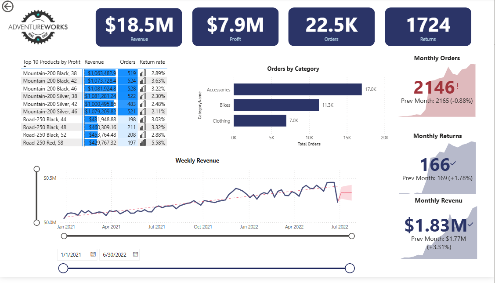
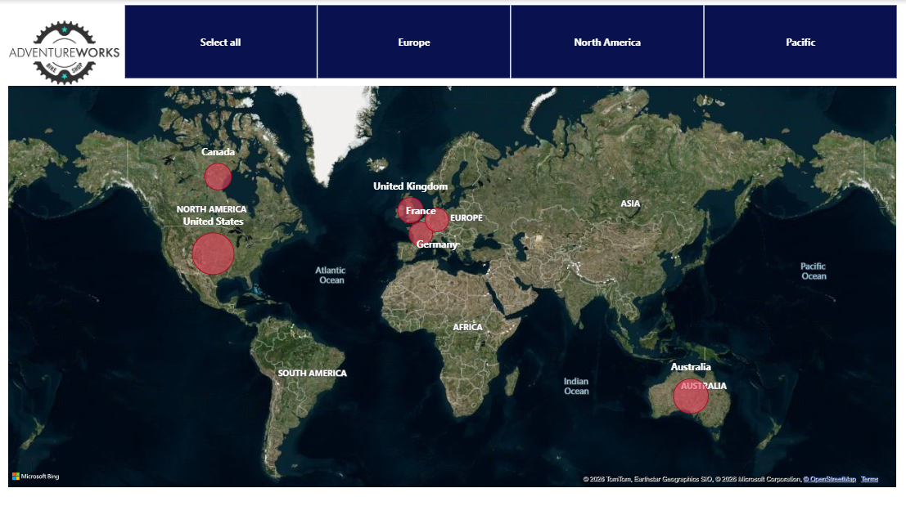
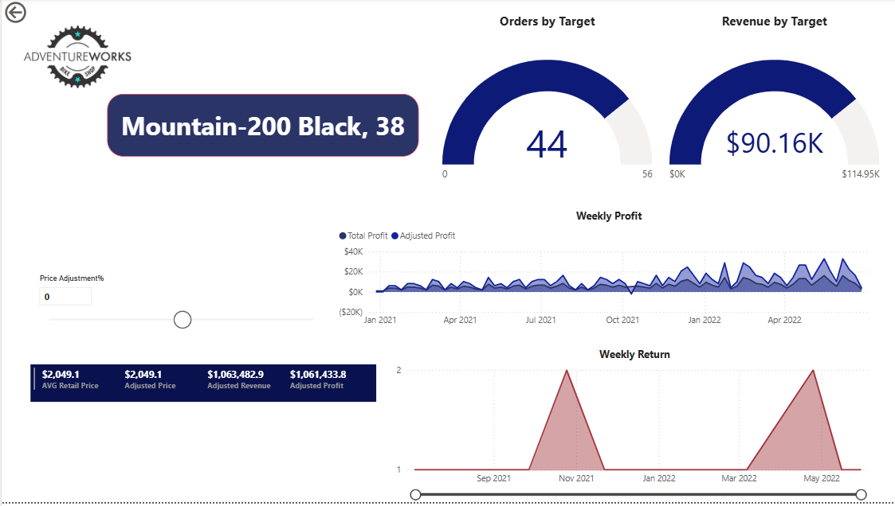

# 📊 analyse-des-performances-commerciales-AdventureWorks

## 📌 Présentation du Projet
Ce projet présente une solution de Business Intelligence développée sur Power BI Desktop pour analyser les ventes en ligne d'AdventureWorks. L'objectif est de transformer des données transactionnelles brutes en un tableau de bord interactif pour piloter la rentabilité commerciale.

* Technologies utilisées : Power BI Desktop, Power Query (ETL), Modélisation Hybride, Langage DAX.
  
## 🛠️ Compétences Techniques Appliquées

### 1. Préparation des Données (Power Query)
* ETL & Nettoyage : Traitement des valeurs manquantes, suppression des doublons et standardisation des types.

### 2. Modélisation des Données (Data Modeling)
* Architecture : Implémentation d'une Modélisation Hybride (Combinaison entre *Star Schema* et *Snowflake Schema*).

### 3. Calculs et Métriques (Langage DAX)
* KPIs : Calculs  du Chiffre d'Affaires, des Profits, des Volumes et du taux de retour.
* Time Intelligence : Analyse des tendances temporelles et de la saisonnalité des ventes.

### 4. Restitution Visuelle & Restitution des Données (Data Visualization)
* Interactivité : Configuration du filtrage croisé (Cross-filtering) entre les visuels et intégration d'une carte géographique dynamique.
* Drill-Through : Configuration d'une page de détails pour l'analyse granulaire par produit.

## 📊 Dashboard

### Executive Dashboard

### Geographic Dashboard

### Product Details

## 🎯 Insights Clés & Conclusion

* Santé Financière : L'entreprise affiche une performance solide avec un chiffre d'affaires de \$18.5M et un profit de \$7.9M (Marge de 42.7%).
* Dynamique des Ventes : Le volume de commandes est porté par la catégorie Accessories (17K), tandis que la valeur financière est dominée par les Bikes.
* Alerte Qualité : Identification de pics d'anomalies avec un taux de retour élevé sur certains modèles, notamment le *Road-250 Red* (5.58%).
* Analyse Géographique : Domination historique du marché en Amérique du Nord et fort potentiel de croissance identifié en Australie.

---

## 📄 Rapport

[Le rapport détaillé du projet est disponible ici](analyse-des-performances-commerciales-AdventureWorks.pdf)

